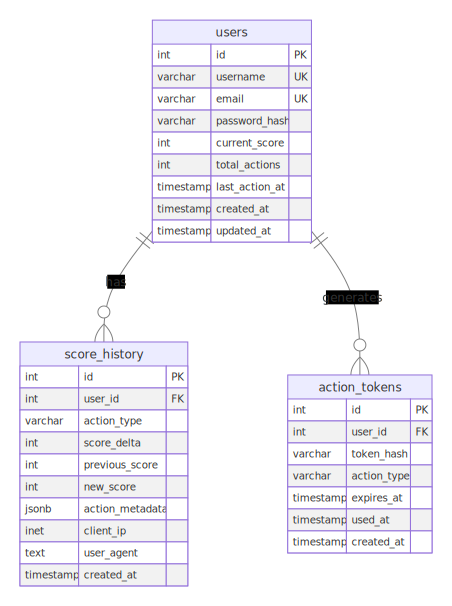

# Live Scoreboard API Module

## Overview

This module provides a real-time scoreboard system that displays the top 10 user scores with live updates. The system ensures secure score updates through proper authentication and authorization mechanisms while providing instant feedback to all connected clients.

## Requirements

1. Show top 10 user scores in real-time
2. Instant scoreboard updates when scores change
3. Prevent unauthorized score manipulation
4. Users complete actions to increase their scores
5. RESTful API for score management

## Architecture

### Core Components

1. **Score Management Service**: Handles score updates and validation
2. **Authentication Service**: Validates user sessions and permissions
3. **Real-time Broadcasting**: SSE for live updates
4. **Leaderboard Cache**: Redis-based caching for performance
5. **Rate Limiting**: Prevents abuse and ensures fair play

### Technology Stack

- **Backend**: NestJS with TypeScript
- **Database**: PostgreSQL with TypeORM
- **Real-time**: Server-Sent Events (SSE)
- **Caching**: Redis for leaderboard and session management
- **Authentication**: JWT tokens with refresh mechanism
- **Validation**: Joi for request validation
- **Documentation**: Swagger/OpenAPI

## Design flow

### High-level flow


### Low-level flow


## Database Schema

### Tables

1. **Users**: Stores user information
2. **Score History**: Tracks individual score updates
3. **Action Tokens**: Anti-cheat measure for validating actions

### ERD



### Users Table


```sql
CREATE TABLE users (
    id SERIAL PRIMARY KEY,
    username VARCHAR(50) UNIQUE NOT NULL,
    email VARCHAR(100) UNIQUE NOT NULL,
    password_hash VARCHAR(255) NOT NULL,
    current_score INTEGER DEFAULT 0,
    total_actions INTEGER DEFAULT 0,
    last_action_at TIMESTAMP,
    created_at TIMESTAMP DEFAULT CURRENT_TIMESTAMP,
    updated_at TIMESTAMP DEFAULT CURRENT_TIMESTAMP
);
```

### Score History Table

```sql
CREATE TABLE score_history (
    id SERIAL PRIMARY KEY,
    user_id INTEGER REFERENCES users(id),
    action_type VARCHAR(50) NOT NULL,
    score_delta INTEGER NOT NULL, 
    previous_score INTEGER NOT NULL,
    new_score INTEGER NOT NULL,
    action_metadata JSONB,
    client_ip INET,
    user_agent TEXT,
    created_at TIMESTAMP DEFAULT CURRENT_TIMESTAMP
);
```

### Action Tokens Table (Anti-cheat)
```sql
CREATE TABLE action_tokens (
    id SERIAL PRIMARY KEY,
    user_id INTEGER REFERENCES users(id),
    token_hash VARCHAR(255) NOT NULL,
    action_type VARCHAR(50) NOT NULL,
    expires_at TIMESTAMP NOT NULL,
    used_at TIMESTAMP,
    created_at TIMESTAMP DEFAULT CURRENT_TIMESTAMP
);
```

## Security

### Authentication Flow
1. **User Login**: JWT token generation with expiration
2. **Token Validation**: Middleware validates JWT on each request
3. **Session Management**: Redis-based session storage
4. **Refresh Tokens**: Automatic token renewal mechanism

### Anti-Cheat Measures

#### 1. Action Token System
**Purpose**: 

It's a strong defense against players modifying client-side code to gain unfair advantages. The server generates the token, so the client cannot simply forge it.

**Action Token Data Structure Example**:

```typescript
interface ActionToken {
    userId: string;
    actionType: 'TYPE_A' | 'TYPE_B' | 'TYPE_C';
    tokenHash: string;
    expiresAt: Date;
    metadata: {
        expectedScore: number;
        clientTimestamp: number;
        sessionId: string;
    };
}
```

**Anti-cheat service validates tokens**


#### 2. Velocity-Based Detection
**Purpose**: Detect unrealistic scoring patterns that indicate automation or cheating.

**Rules**:
- Maximum 10 actions per minute per user
- Score increases cannot exceed 100 points per action
- Time between actions must be at least 3 seconds
- Maximum daily score increase: 5000 points

**Velocity Check Data Structure Example**:

```typescript
interface VelocityCheck {
    userId: string;
    actionsInLastMinute: number;
    lastActionTime: Date;
    dailyScoreIncrease: number;
    suspiciousPatterns: string[];
}
```

#### 3. Score Validation Rules
**Purpose**: Ensure score updates follow game logic and business rules.

**Score Validation Rules Data Structure Example**:

```typescript
interface ScoreValidationRules {
    actionType: string;
    minScore: number;
    maxScore: number;
    requiredConditions: string[];
    cooldownPeriod: number;
}
```

#### 6. Comprehensive Anti-Cheat Flow


## API Endpoints suggestion:

### Authentication Endpoints

```
POST /api/auth/login
POST /api/auth/register
POST /api/auth/refresh
POST /api/auth/logout
```

### Score Management Endpoints
```
GET  /api/scores/leaderboard     # Get top 10 scores
GET  /api/scores/user/:id        # Get user's score details
POST /api/scores/action          # Submit completed action
GET  /api/scores/history/:userId # Get user's score history
```

### Real-time Endpoints
```
GET /api/realtime/leaderboard    # SSE connection endpoint for live updates
```

## 📡 Real-time Implementation

### Server-Sent Events (SSE) Implementation

Server-Sent Events (SSE) is a web technology that allows a web server to push data to a client (browser) over a single, long-lived HTTP connection. It's a unidirectional communication channel, meaning data flows only from the server to the client.

The reason why we picking up the SSE is that it's a simple and efficient way to push updates to the client. It's built into modern browsers and doesn't require any additional libraries. And because we're only need to update the score, that mean it one way communication.

#### SSE Diagram


## Score Update Flow

### Action Completion Process
1. **Client Action**: User completes an action in the frontend
2. **Token Generation**: Server generates action token (if pre-validation needed)
3. **Score Submission**: Client submits action with token/proof
4. **Validation**: Server validates action legitimacy
5. **Score Update**: Database score update with transaction
6. **Cache Update**: Redis leaderboard cache refresh
7. **Broadcast**: Real-time SSE update to all connected clients

### Score Update Flow Diagram


### Request/Response Format Example:

```typescript
interface ScoreUpdateRequest {
    actionType: string;
    actionToken?: string;
    actionData?: Record<string, any>;
    clientTimestamp: number;
}

interface ScoreUpdateResponse {
    success: boolean;
    newScore: number;
    scoreDelta: number;
    newRank?: number;
    leaderboardUpdate?: LeaderboardEntry[];
}
```

## Rate Limiting & Abuse Prevention

### Rate Limiting Rules

Example:

```typescript
const rateLimits = {
    scoreUpdate: {
        windowMs: 60 * 1000,      // 1 minute
        maxRequests: 10,          // 10 actions per minute
        skipSuccessfulRequests: false
    },
    leaderboardView: {
        windowMs: 10 * 1000,      // 10 seconds  
        maxRequests: 30           // 30 requests per 10 seconds
    }
};
```

## Config

- **Environment Variables**: `.env` file for sensitive config
- **Example** `.env` file:
```bash
DB_HOST=localhost
DB_PORT=5432
DB_USERNAME=postgres
DB_PASSWORD=password
DB_NAME=scoreboard
REDIS_HOST=localhost
REDIS_PORT=6379
JWT_SECRET=your-secret-key
JWT_EXPIRATION=3600
REFRESH_TOKEN_EXPIRATION=86400
```

## Implementation

### Code Structure

The below will show the suggestion code structure for the new module

```
src/
├── app.module.ts
├── main.ts
├── auth/
│   ├── auth.module.ts
│   ├── auth.controller.ts
│   ├── auth.service.ts
│   ├── guards/
│   │   ├── jwt-auth.guard.ts
│   │   └── rate-limit.guard.ts
│   └── strategies/
│       └── jwt.strategy.ts
├── scoreboard/
│   ├── scoreboard.module.ts
│   ├── controllers/
│   │   ├── score.controller.ts
│   │   └── leaderboard.controller.ts
│   ├── services/
│   │   ├── score.service.ts
│   │   ├── leaderboard.service.ts
│   │   ├── realtime.service.ts
│   │   └── anti-cheat.service.ts
│   ├── entities/
│   │   ├── user.entity.ts
│   │   ├── score-history.entity.ts
│   │   └── action-token.entity.ts
│   └── dto/
│       ├── score-update.dto.ts
│       └── leaderboard.dto.ts
├── common/
│   ├── decorators/
│   │   └── user.decorator.ts
│   ├── filters/
│   │   └── http-exception.filter.ts
│   ├── interceptors/
│   │   └── logging.interceptor.ts
│   └── pipes/
│       └── validation.pipe.ts
├── config/
│   ├── database.config.ts
│   ├── redis.config.ts
│   └── app.config.ts
└── types/
    └── api.types.ts
```

## Consider to improvement

Adding more solution to prevent the cheating behavior

### Implementation Plan

Adding the plan how to implement the new module into the existing system by split it into the manageable tasks

### Testing strategy

Detail more about the testing strategy if we have more detail about the testing framework and tools that we are using, the timeline of the project and the team size

### Caching Strategy & Database Optimization

Adding more index or caching base on the metrics after observing the performance of the system

### Deployment and Scalability

Detail about how to integrate the new module into the current infrastructure of the existing system

### Monitoring and Observability

Need to have the system can observe the behavior of the user so we can prevent any cheating behavior.